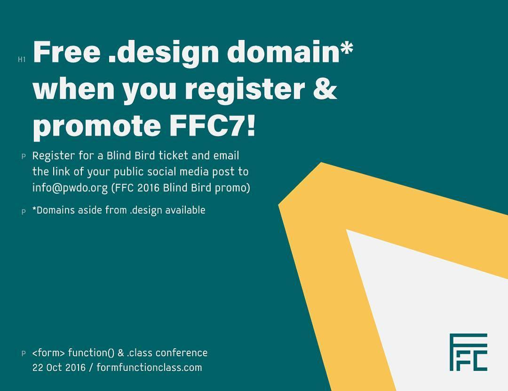

# Form Function & Class 7

Good design is more valuable than ever. Without it, bad design takes over, causing our users to suffer. 

This November 14th, we’re flying in the sharpest minds in design & development, armed with strategies to eliminate faulty interfaces, substandard code, and poor experiences. 

You won't just get inspired, but all fired up to be better designers and make great things. Register for Form Function & Class 6 now!

<!-- <figure>
	
</figure> -->

- abc
- def
- ghi